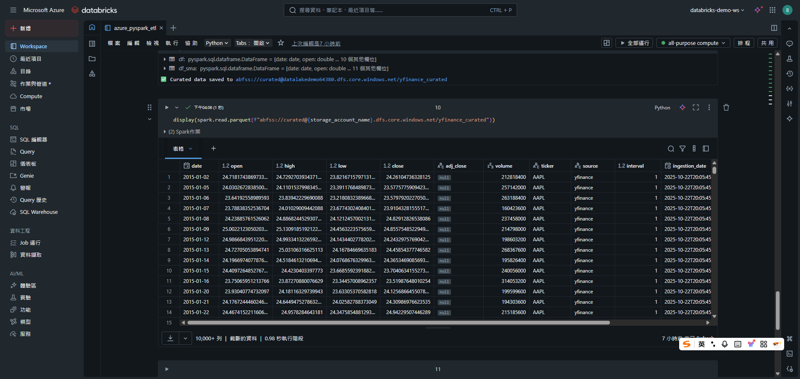
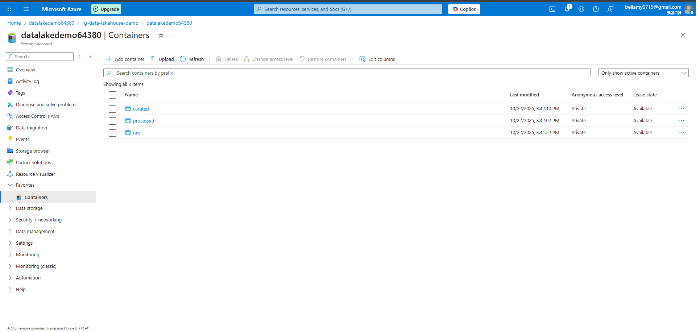
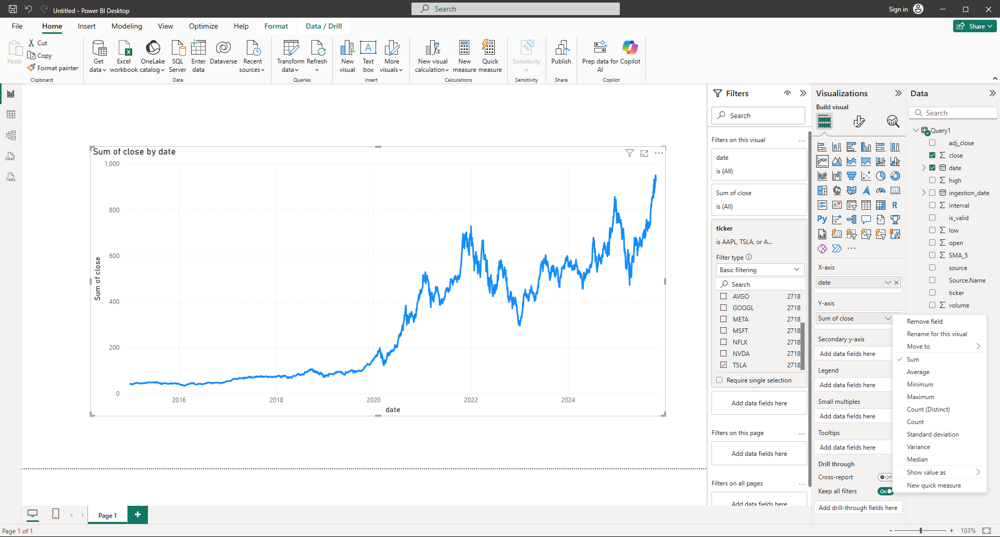
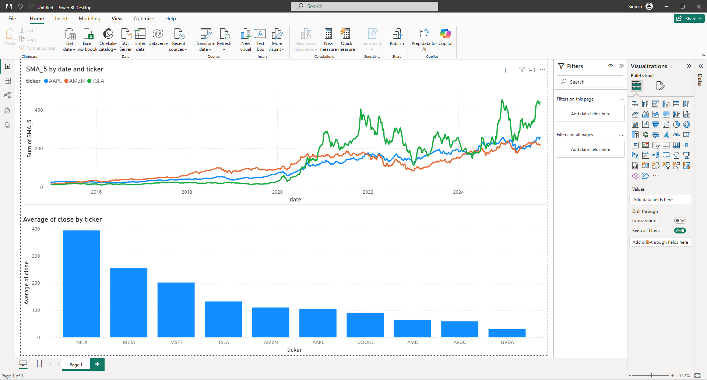
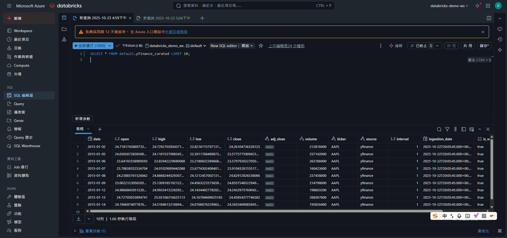

# azure_databricks_lakehouse_pipeline
End-to-end ETL pipeline on Azure using Databricks, PySpark, and ADLS Gen2 by automating stock data ingestion from yfinance, transformation, and curated storage in Parquet for analytics.

### Multi-Cloud Architecture
This project has been reimplemented on AWS(main) by using **Databricks + S3 + Glue + Athena + QuickSight** for identical ETL and analytical workflows with more details
### >  Check out the AWS Implementation 
> [aws-pyspark-data-lakehouse-pipeline](https://github.com/Bellamy0719/aws-pyspark-data-lakehouse-pipeline)

### Project Overview

A batch processing data lakehouse pipeline built on Azure and Databricks using PySpark.
It ingests and processes historical stock market data across multiple layers (raw → processed → curated),
then enables analytics through Azure Synapse and Power BI dashboards.

This project demonstrates how to architect a modern Azure Data Lakehouse for scalable batch analytics.
Using Databricks (serverless PySpark) and Azure native services, the pipeline extracts, transforms, and organizes financial data within a structured Data Lake Gen2 (ADLS) hierarchy:

Raw layer — unprocessed CSVs fetched from Yahoo Finance
Processed layer — cleaned, normalized, and feature-enriched datasets
Curated layer — analytics-ready Parquet data partitioned by ticker and year

All datasets are cataloged through Unity Catalog / External Locations, queried with Synapse Serverless SQL,
and visualized interactively in Power BI.

### Architecture Overview

**Storage**: Azure Data Lake Storage Gen2 (ADLS) hosts multi-layered data zones (raw → processed → curated).

**Compute**: Databricks Serverless / Classic Clusters execute PySpark ETL and feature engineering.

**Metadata**: Unity Catalog + External Locations manage schema, permissions, and lineage.

**Query & Analysis**: Azure Synapse Serverless SQL queries curated Parquet data.

**Visualization**: Power BI visualizes stock trends and indicators interactively.

```
                   yfinance API
                         │
                         ▼
                  ┌─────────────────────┐
                  │   Raw (ADLS Gen2)   │   ←  Original CSVs
                  └─────────────────────┘
                         │
                         ▼
               ┌──────────────────────────┐
               │ Databricks + PySpark ETL │  ←  Extract / Transform / Load
               └──────────────────────────┘
                         │
                         ▼
                 ┌──────────────────────┐
                 │ Processed (ADLS)     │  ← Cleaned + Feature-enriched
                 └──────────────────────┘
                         │
                         ▼
                 ┌──────────────────────┐
                 │ Curated (ADLS)       │  ←  Partitioned Parquet (ticker/year)
                 └──────────────────────┘
                     │          │
                     ▼          ▼
               Unity Catalog   Synapse SQL  ←  Query and govern curated data
                     │
                     ▼
                Power BI Reports     ←  Interactive dashboards and analytics

```

### Tech Stack

| Category          | Tools / Services                                         |
| ----------------- | -------------------------------------------------------- |
| **Compute**       | Azure Databricks (Serverless PySpark)                    |
| **Storage**       | Azure Data Lake Storage Gen2 (Raw / Processed / Curated) |
| **Metadata**      | Unity Catalog + External Locations                       |
| **Query Engine**  | Azure Synapse Analytics (Serverless SQL Pool)            |
| **Visualization** | Power BI Desktop / Power BI Service                      |
| **Data Source**   | yfinance (Yahoo Finance API)                             |
| **Format**        | Parquet (partitioned by ticker & year)                   |

### Step 1. Data Ingestion (Producer — yfinance → ADLS)

Purpose:
Fetches historical stock data from the Yahoo Finance API using Python (yfinance), then writes raw CSV files into the Azure Data Lake Storage (ADLS) raw zone.
Located in: [azure_pyspark_etl.ipynb](notebooks/azure_pyspark_etl.ipynb)

```
try:
        df = yf.download(t, start=start_date, interval="1d", auto_adjust=True, progress=False)
```

Summary:
Initializes the data lakehouse pipeline by ingesting external market data into the Raw layer of ADLS for downstream PySpark transformations.

### Step 2. Transformation (Databricks — PySpark → ADLS Processed)

Purpose:
Cleans and standardizes raw stock data, computes technical indicators (SMA, RSI, MACD, Bollinger Bands), and writes results to the Processed layer in ADLS as Parquet files. (In this project, I only add SMA_5 as a new feature, more details on the AWS project)
Located in: [azure_pyspark_etl.ipynb](notebooks/azure_pyspark_etl.ipynb)

```
windowSpec = Window.partitionBy("ticker").orderBy("date").rowsBetween(-4, 0)
df_sma = df.withColumn("SMA_5", round(avg(col("close")).over(windowSpec), 2))
```

Summary:
Implements the PySpark-based ETL job that transforms raw CSVs into clean, analytics-ready datasets for feature engineering.

### Step 3. Feature Engineering (PySpark → ADLS Curated)

Purpose:
Adds feature layers such as moving averages, volatility, RSI, MACD, and buy/sell signal flags, saving the enriched results in the Curated ADLS zone. (In this project, I only add SMA_5 as a new feature, more details on the AWS project)
Located in: [azure_pyspark_etl.ipynb](notebooks/azure_pyspark_etl.ipynb)

```
curated_path = f"abfss://curated@{storage_account_name}.dfs.core.windows.net/yfinance_curated"
df_sma.write.mode("overwrite").parquet(curated_path)
```


Summary:
Transforms processed datasets into a feature-rich, partitioned Parquet layer optimized for analytics and downstream SQL querying.

### Step 4. Metadata Registration (Unity Catalog → Table)

Purpose:
Registers the curated Parquet folder as an external table under Unity Catalog for querying and governance.


```
CREATE TABLE IF NOT EXISTS default.yfinance_curated
USING PARQUET
LOCATION 'abfss://curated@datalakedemo64380.dfs.core.windows.net/yfinance_curated/';
```

Summary:
Makes curated data queryable via Databricks SQL, Synapse, or Power BI, establishing schema and lineage tracking.

### Step 5. Analytics & Visualization (Synapse / Power BI)

Purpose:
Runs analytical SQL queries and creates visual dashboards for stock performance, moving averages, and technical indicators.
Located in: [screenshots](screenshots/)



```
SELECT ticker, AVG(close) AS avg_close, MAX(close) AS max_close
FROM default.yfinance_curated
GROUP BY ticker;
```

Summary:
Delivers cloud-based interactive analysis using Synapse SQL or Power BI directly connected to the curated Parquet layer in ADLS.


### Project Structure

```
databricks-azure-stock-lakehouse/
├── notebooks/
│   └── azure_pyspark_etl.ipynb     # End-to-end ETL and feature engineering
│
├── screenshots/
│   ├── sql_dashboard/       
│   ├── databrick_display/      
│   ├── azure_dashboard/     
│   ├── power_bi1/        
│   └── power_bi2/         
│
├── README.md
└── LICENSE
```

